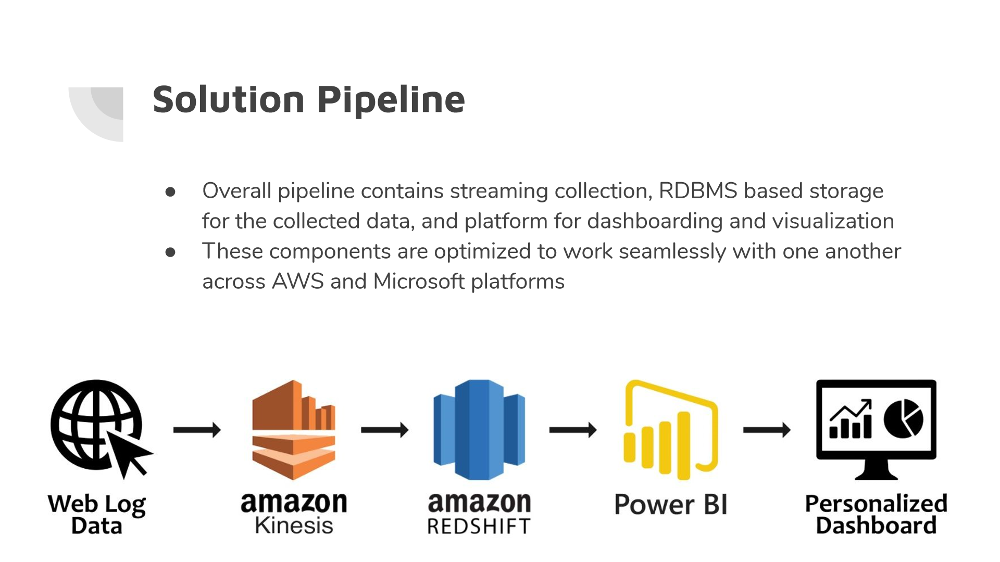
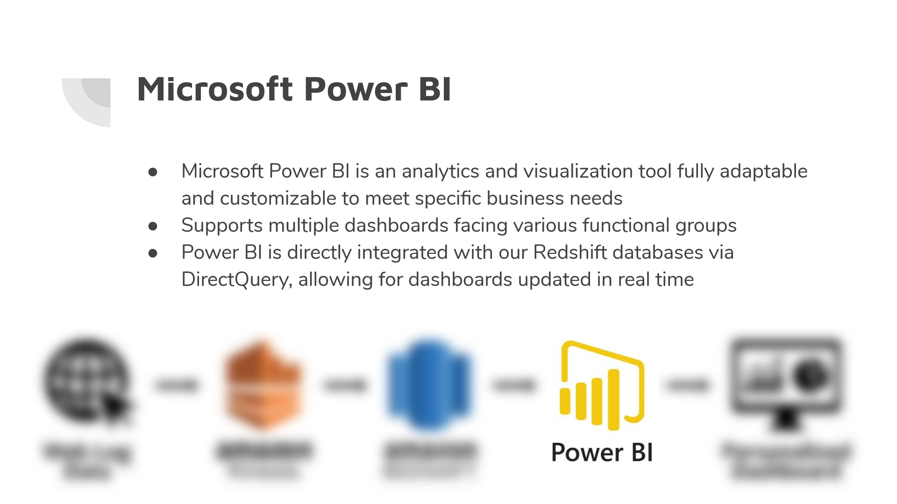
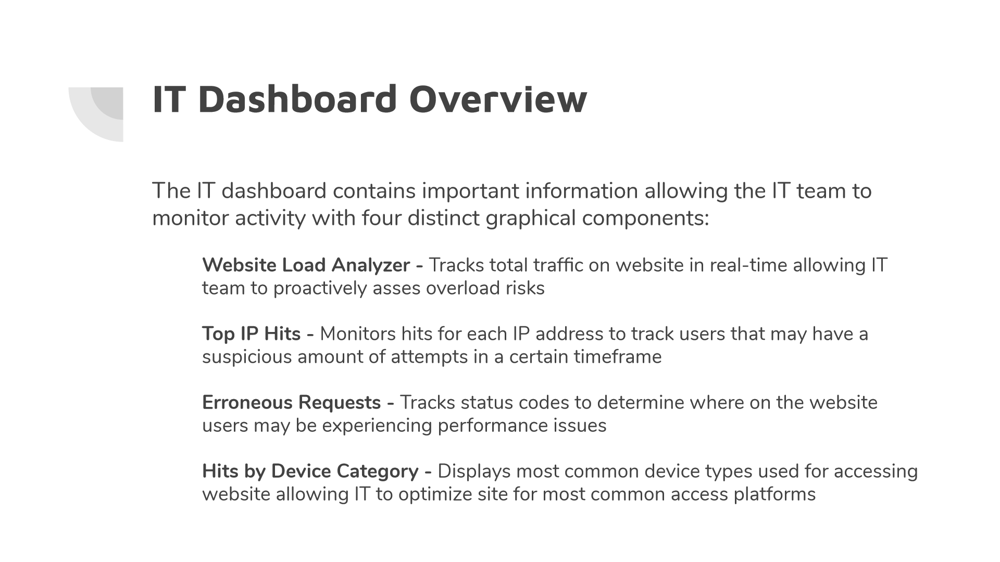
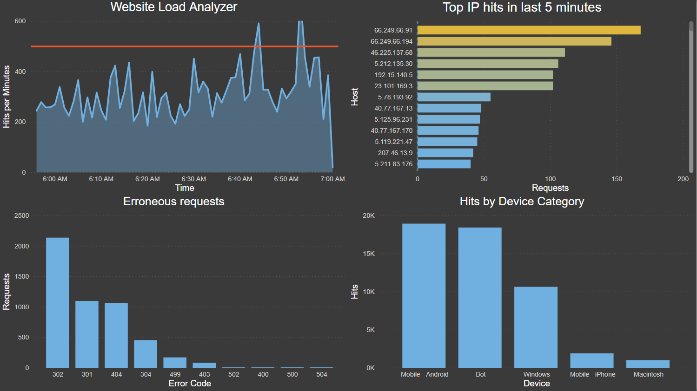
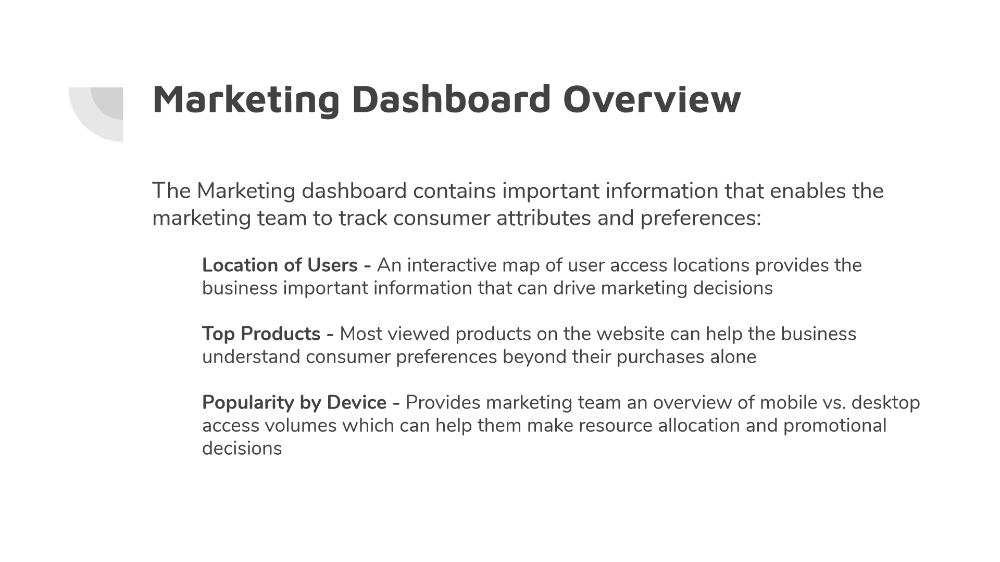
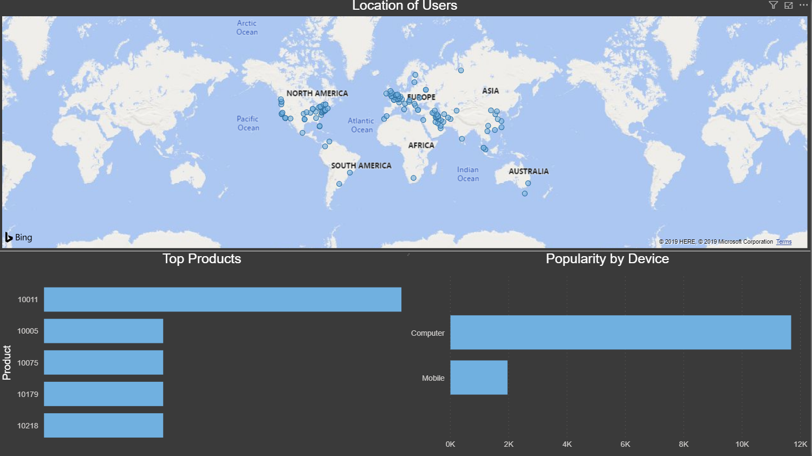
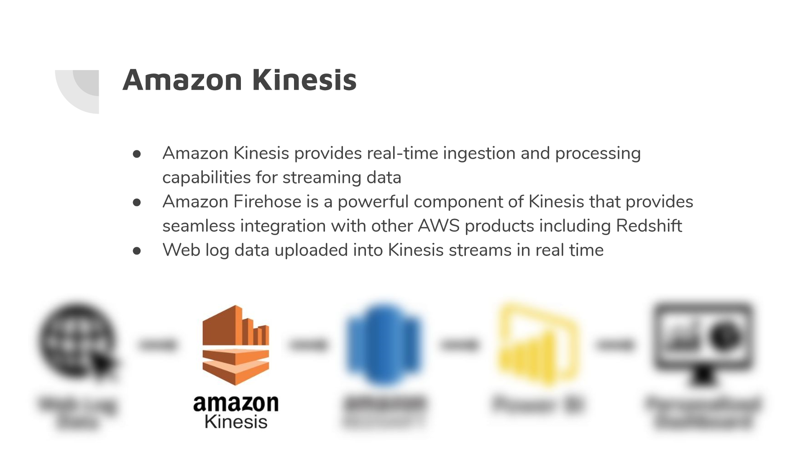
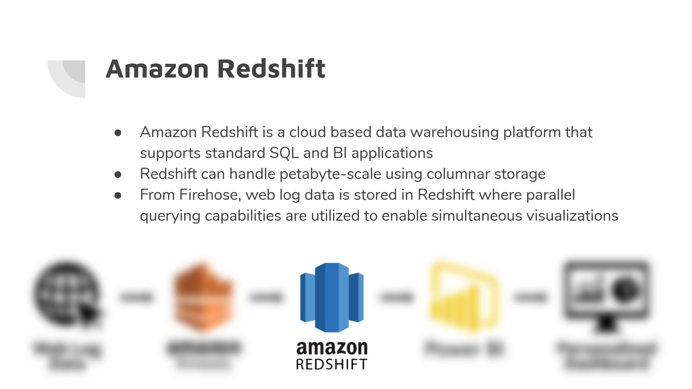
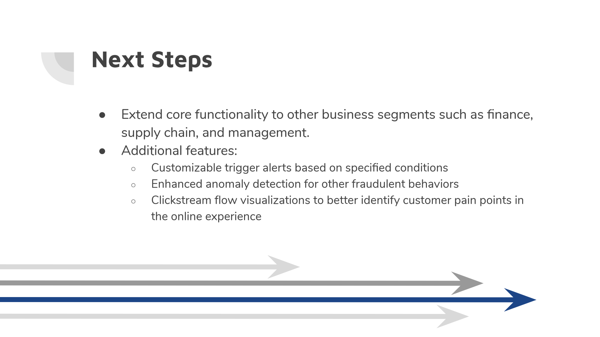

# Realtime Web Log Data Analysis

### Leveraging Amazon Web Services in conjunction with Power BI to Fuel Real-Time Dashboards

## Abstract:
Web log data contains an enormous amount of information and insights for an organization if utilized
properly. Iranian e-commerce company Zanbil has concerns regarding its ability to effectively monitor
online activity as it continues to grow. Additionally, it hopes to gain a better understanding of how its
users are interacting with the website. Using Amazon Kinesis, Amazon Redshift, and Microsoft Power BI,
we are able to provide Zanbil real-time dashboards using web log data in standard Apache form. Our
solution provides visibility of the user experience and flags potentially fraudulent behavior as it happens.

## Solution Overview
In conclusion, our solution provides value to two key parts of any organization. On the IT side, it enables staff to monitor the website quality in order to ensure the best possible user experience and simultaneously help protect the website from threats. On the marketing side, it allows the organization to better understand its customers and make important promotional decisions using this information. For Zanbil, these two dashboards will be paramount in maintaining the security of its website and providing the best possible user experience for consumers while experiencing rapid and unpredictable growth.

The overall pipeline our solution follows includes streaming collection from the raw web log data, RDBMS storage, a platform for dashboarding, and finally the final visualizations that have been created. The components used in this project are optimized to work seamlessly together across Amazon Web Services and Microsoft platforms. In the following slides, we will describe each individual technology in further detail.

## Power BI Tool
Here, we transfer the data out of AWS for dashboarding. Power BI is a very flexible analytics and visualization tool that can be customized to suit varying business needs. It offers the ability to host multiple dashboards facing different functional groups with personalized content. In addition, it is part of Microsoft enterprise software. As many companies in the area are Microsoft based, they already pay for access to Power BI and have some familiarity. Rather than paying for another service from AWS, our solution leverages software that is already part of day to day operations for many companies. We are able to directly integrate our Redshift database via DirectQuery, allowing for real time updates to the various Power BI dashboards as new data is processed.

  

### IT Dashboard Overview
The first dashboard, the IT Dashboard, is a hub that enables the IT team to monitor how many users are accessing the site at one time, how many times each individual user is accessing the site, parts of the site that may be having issues, and through which platforms are users accessing the site.
  

Below is the scfreenshot of the IT View of the Dashboard

### Marketing Dashboard Overview
The second component of our solution is the marketing dashboard. The marketing dashboard contains information about the location of the website’s users, the current top products on the website measured by view count and the number of users accessing the site via desktop and mobile device.
  

Below is the scfreenshot of the Marketing View of the Dashboard

## Tools and Technologies
### Amazon Kinesis
This service enables real-time ingestion and processing forstreaming data. Through the Firehouse component, users have the ability to seamlessly integrate data streams with other AWS products including storage options like Redshift. Kinesis boasts low latency and an easily scalable solution for high throughput data. In this project, web log data is uploaded into Kinesis streams in real-time and then passed to Redshift for storage.

### Amazon Firehose
Amazon Kinesis Data Firehose is the easiest way to reliably load streaming data into data lakes, data stores and analytics tools. It can capture, transform, and load streaming data into Amazon S3, Amazon Redshift, Amazon Elasticsearch Service, and Splunk, enabling near real-time analytics with existing business intelligence tools and dashboards you’re already using today. It is a fully managed service that automatically scales to match the throughput of your data and requires no ongoing administration. It can also batch, compress, transform, and encrypt the data before loading it, minimizing the amount of storage used at the destination and increasing security.

You can easily create a Firehose delivery stream from the [AWS Management Console](https://console.aws.amazon.com/firehose/), configure it with a few clicks, and start sending data to the stream from hundreds of thousands of data sources to be loaded continuously to AWS – all in just a few minutes. 

We configure the firehose to send the streaming data from amazon Kinesis to Redshift. We use [this tutorial by Tom Thornton
](https://medium.com/swlh/real-time-data-streaming-with-python-aws-kinesis-how-to-part-1-cd56feb6fd0f) to set up the Kinesis Stream and Firehose Delivery system.

### Amazon Redshift
Redshift is a cloud-based data warehousing platform. It has support for standard SQL and various BI applications. Using columnar storage format, it is able to handle data in the scale of petabytes. In addition, this service has massively parallel querying capabilities to select data from various views of the database simultaneously. Our product utilizes Redshift to house web log data and its parallel querying functionality to update figures in real time. 

### Power BI
This platform fuels intuitive analytics and visualizations in a user-friendly interface. It is fully customizable to meet any business needs. Additionally, Power BI allows for multiple dashboards facing different functional groups. Since 2016, integration with data sources from AWS is supported. In our project, streaming data read in Redshift is integrated directly with Power BI through DirectQuery. Graphics update automatically with new data. 

### Next Steps

## Reference Links
[https://aws.amazon.com/kinesis/](https://aws.amazon.com/kinesis/)  
[https://aws.amazon.com/redshift/](https://aws.amazon.com/redshift/)  
[https://powerbi.microsoft.com/en-us/](https://powerbi.microsoft.com/en-us/)  
[https://www.loggly.com/](https://www.loggly.com/)  
[https://goaccess.io/](https://goaccess.io/)  
[https://dataverse.harvard.edu/dataset.xhtml?persistentId=doi:10.7910/DVN/3QBYB5](https://dataverse.harvard.edu/dataset.xhtml?persistentId=doi:10.7910/DVN/3QBYB5)  
